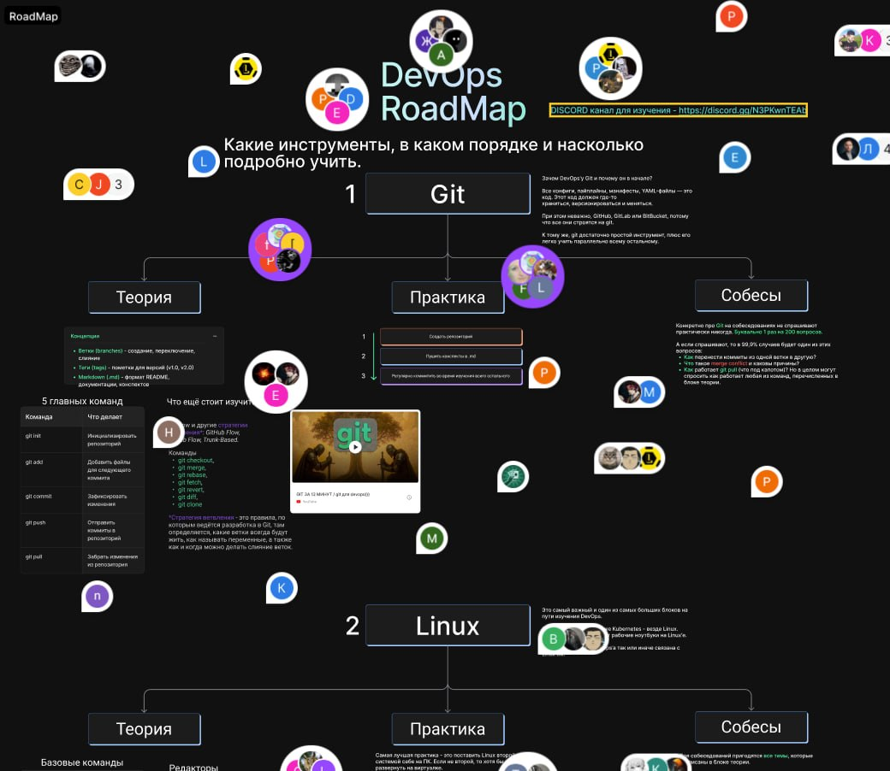

# Источники

Полезные материалы, roadmap и ссылки для обучения.

## DevOps

### Roadmap ”Просто DevOps”

- **Тип:** Figma / roadmap
- **Ссылка:** [Roadmap ”Просто DevOps”](https://www.figma.com/board/bnJJyqyzF0nDwXL3U3Lh7h/Roadmap-%D0%9F%D1%80%D0%BE%D1%81%D1%82%D0%BE-Devops?node-id=2-224&t=2KXVpz9jXwJ20fQV-0)
- **Описание:** визуальная дорожная карта по изучению DevOps.

## Как использовать

1. Открыть источник.
2. Выписать важные темы в отдельные заметки.
3. Добавлять конспекты в папку `NOTEBOOK`.